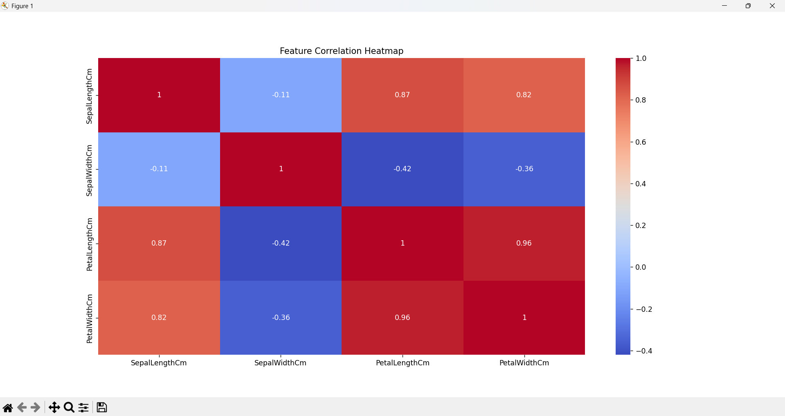
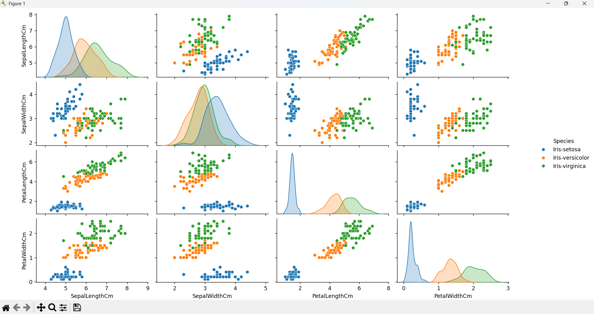
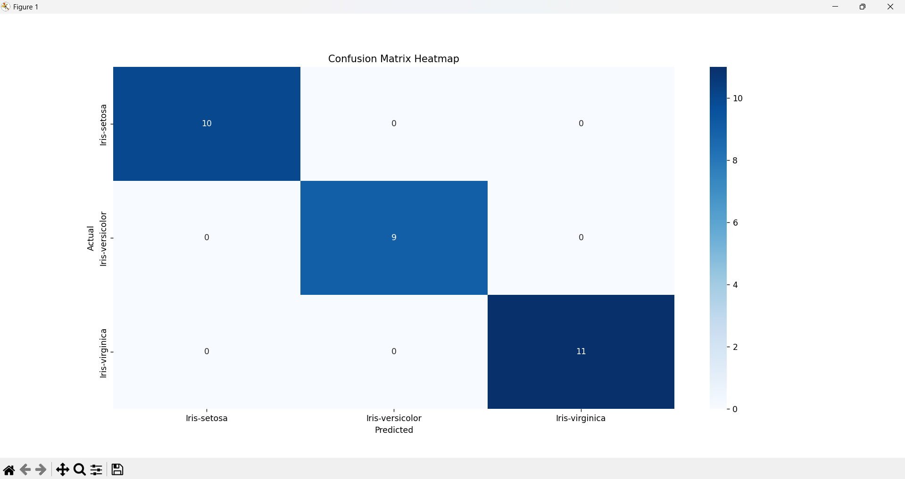
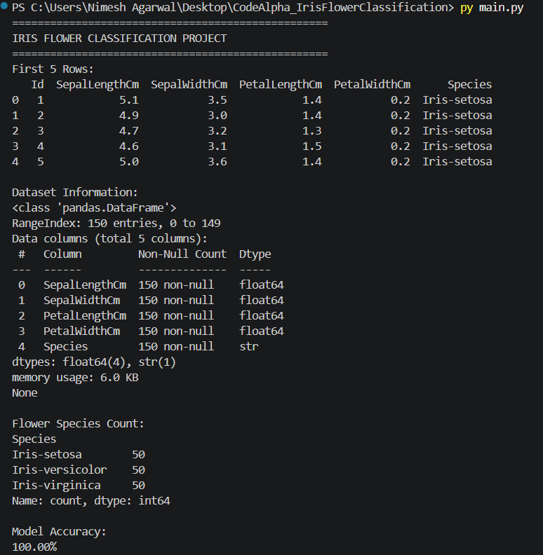
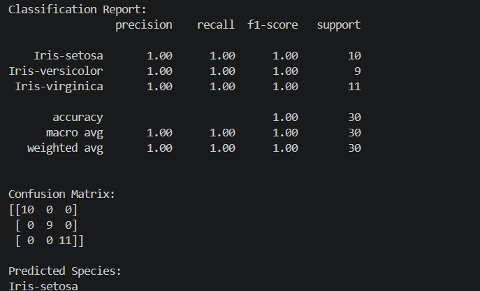

# Iris Flower Classification

This project is a Machine Learning classification model that predicts the species of Iris flowers using flower measurements.

## Features
- Data preprocessing
- Data visualization
- Correlation heatmap
- Pairplot visualization
- K-Nearest Neighbors (KNN) classification
- Model evaluation
- Confusion matrix visualization
- Flower species prediction

## Technologies Used
- Python
- Pandas
- NumPy
- Matplotlib
- Seaborn
- Scikit-learn

## Machine Learning Algorithm
K-Nearest Neighbors (KNN)

## Dataset
Iris Dataset from Kaggle

## Accuracy
100.00%

## Flower Species
- Iris-setosa
- Iris-versicolor
- Iris-virginica

## Project Screenshots

### Correlation Heatmap

### Pairplot Visualization

### Confusion Matrix

### Terminal Output - Part 1

### Terminal Output - Part 2
